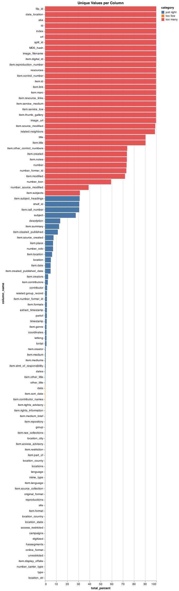

# Notes

- Running a bit behind on this but trying to jump into today now that I have the initial dataset good to go.

Goals for today:

- Explore the dataset field and explore distribution of metadata, as well as what might be some good categorical fields
- Also explore some CV approaches to clustering the images



So this is the list of fields from the README:

- ~~access-restricted: used for limiting access to some items from offsite:~~ ALL are false
- aka: alternative identifiers for documents (e.g., shortcut urls)
- campaigns: added at display time if a search result needs campaign codes added to the published url
- contributor: generally used for name/related names such as photographer, author, etc. but is distinct from names in subject field. For these images, this fields usually cites the photographer or copyright claimant
- coordinates: a text version of geographical coordinates; typically drawn from a MARC field
- date: a date chosen from all available dates to be the sortable date. Can be the creation date, publication date, or a date referenced in the item depending on website target and cataloging; entries in this field could be formatted as a year or YYYY-MM-DD. Items are sortable by this date.
- dates*: List of dates related to the item. In ISO 8601 format, UTC. Items are facetable by these dates.
- description: often includes a short, summary description of the original physical item written to accompany the item in a list of search results; for these images, descriptions can be created from MARC records content and/or pulled from the [Prints and Photographs Online Catalog](https://www.loc.gov/pictures/)
- digitized: true/false; indicates whether a digital surrogate exists
- extract_timestamp: timestamp of most recent ETL process
- group: ETL group
- hassegments: true/false for having segmented data (pages, bounding boxes of images, audio segmentation, etc.) in the index
- id: uniform resource identifier, aka uri, for an item; resolves as a url beginning in http.
Note: for historical reasons, the ID follows the pattern of an HTTP URL, not an HTTPS URL, event though loc.gov now supports only HTTPS.
- image-url: URLs for images in various sizes, if available. If the item is not something that has an image (e.g. it’s a book that’s not digitized or an exhibit), the URL for the image might be for an icon image file. The url is meant to convey enough information to be used for various result displays (i.e. list, grid, gallery, slideshow) described in more detail in the 'resources' element.
- index: the index number of the results among all results. This starts with 1 and continues through all of the results in the whole set (not just this page).
- language: languages associated with the item
- latlong: latitude and longitude from a lookup table based on the location cited in the catalog record
- location: place(s) related to the item. These are extracted from subject headings and other metadata, so there may be duplicates.
- location_city*: field for cities related to the item
- location_country*: field for countries related to the item
- location_state*: field for state related to the item
- location_county*: field for counties related to the item
- location_str:
- locations: locations expressed as searches in facets
- lonlat: latitude and longitude from a lookup table based on the location cited in the catalog record
- mime-type: the formats available for a digitized item
- number*: Swiss-Army knife for "numbers" - e.g., OCLC number, shelf number, etc.
- number_carrier_type*
- number_former_id*
- number_lccn*
- number_oclc*:
- number_source_modified*
- online-format: text name of the online format, usually derived from mime type; superset of mime-type(s)
- original-format: the kind of object being described (not the digitized version). If the record is for an entire collection, that is included here.
- other-title: alternative language titles, other alternative titles
- partof: collections, divisions, units in the Library of Congress, or any of a number of less formal groupings and subgroupings used for organizing content.
- related: helps the website make connections between related content on the website.
- reproductions: advisory note from the Prints and Photographs division on downloading images offsite or purchasing copies through Library of Congress Duplication Services.
- resources: details of digital content and structure
- shelf-id: primary sorting field of item records; variously derived based on website target; for these images, shelf id contains the unique call number citation for the item in the Prints & Photographs Division
- site: originally showed the source system, used in transform for display methods, tracks ETL target closely
- subject: list of subjects. These are separated elements of the Library of Congress Subject Headings. Geography is not shown here, see the location element.
- timestamp: time record inserted in the web index
- title: title of the item
- type*: medium of original item, i.e. "still image"
- unrestricted: true or false
- url: URL on the loc.gov website. If the items is only in the library catalog, the URL will start with lccn.loc.gov.

The following `item` subfields of the `content.results` section are mainly for display of the item on the loc.gov website. These subfields may pull information from the Prints and Photographs Online Catalog API and/or website target-specific interpretations of MARC records.

- item.access_advisory*: information provided about whether the item described can be accessed directly
- item.call_number
- item.contributors
- item.control_number
- item.created
- item.created_published
- item.created_published_date
- item.creator*:
- item.creators
- item.contributor_names*:
- item.date
- item.digital_id
- item.display_offsite: similar to `access_restricted`; used for limiting access to some items from offsite
- item.format
- item.formats
- item.genre
- item.id
- item.language
- item.link
- item.location
- item.marc
- item.medium
- item.medium_brief
- item.mediums
- item.modified
- item.number_former_id*:
- item.notes
- item.other_control_numbers*: ex. "22762560"
- item.other_title*:
- item.place
- item.part_of*:
- item.raw_collections*: ex: diof, pp, stereo
- item.repository
- item.reproduction_number
- item.resource_links
- item.restriction*:
- item.rights_advisory
- item.rights_information
- item.service_low
- item.service_medium
- item.stmt_of_responsibility*: for stereographs, this is usually information transcribed from the item stating the name of the photographer or publisher
- item.sort_date
- item.source_created
- item.source_collection*:
- item.source_modified
- item.subject_headings
- item.subjects
- item.summary
- item.thumb_gallery
- item.title

The following are `related` subfields of the `content.results` section:

- related.group_record
- related.lot_link*:
- related.neighbors


Need to delete some of the fields above but think I'm going to try some initial image classification using subject headings. I dont' think I'll use the sample dataset since it's randomly selected and might have biased subject classes.

Tried Douglas Duhaime's `shears` package to see if I could extract the metadata around

```python
import shears

# extract the image content
result = shears.clip('private_materials/sample-data/data/00650985_03327r.jpg',
                      filter_min_size=900,
                      filter_threshold=0.8,
                      filter_connectivity=1)

# show the extracted image
shears.plot_image(result)

# save the extracted image
shears.save_image(result, 'result.jpg')
```